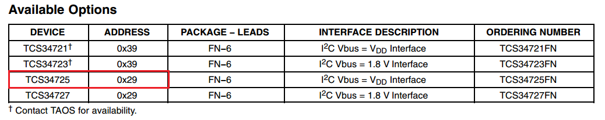
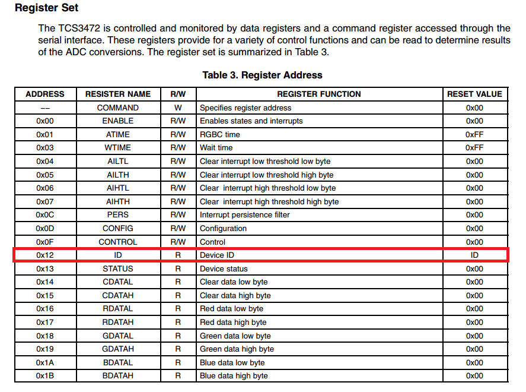
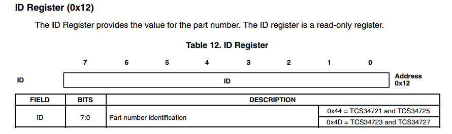

# Designing a library for an unknown device using Windows 10 IoT Core
I love Windows 10 IoT Core.

An example I'll often use in my IoT lectures is that we're using the highest level construct I can think of (UWP Color) to drive the lowest level I can think of (pushing voltage to an RGB LED). This is an extremely powerful connection as now we have all of the debugging/development capabilities (including IntelliSense!) of Visual Studio with the added capability of interacting with real-world electronics.

Being able to create a GUI on my development machine using UWP and deploying it across the network to the embedded device has made creating rich, easy to use interfaces a breeze. Here is an SPI RFID system that I was able to prototype in a day's worth of work :


..but what if you are using an obscure device doesn't have a library? I'd like to show a strategy to start writing your own so you can leverage the vast array of sensors available regardless of the currently supported drivers. 

I'd argue that this is a useful exercise even if libraries are readily available. Creating your own class based on the datasheet will leave you with a deep understanding of how your device operates and you may be able to invoke commands that may not be readily exposed by existing library. A real-world example of this was discovering a sleep mode register that was not exposed by the default library which allowed more aggressive power management for a battery powered project.

I'd like to do this project for every communications type in the future, this project will cover writing a library for an *I2C* device.
# Strategy
First up let's lay out a strategy - we'll use the datasheet to:
* Determine the supply voltage
* Determine a communications method (SPI, I2C, UART)
* Determine a pinout and wire up the device to the correct Raspberry Pi peripheral
* Set appropriate connection properties
    * SPI - Mode / speed
    * I2C - Speed (standard/fast mode) / address
    * UART - Baud Rate, start/stop bits
* Initialize the communications bus
* Verify connectivity by reading manufacturer / device ID
* Implement commands as needed from datasheet
* Create a class that will handle communications under the hood

In this example we'll be using a [TCS34725 Color Sensor Breakout Board](https://www.adafruit.com/product/1334) device from Adafruit to change the background of a UWP application. [The datasheet can be found here.](https://cdn-shop.adafruit.com/datasheets/TCS34725.pdf)

`The TCS3472 device provides a digital return of red, green, blue (RGB), and clear light sensing values.`

## Note: The Big Bad Datasheet
You should not be intimidated by a datasheet, as a developer you should seek out information that you need. They tend to be dense, but know that although all of the information is relevant to *somebody*, it's likely that you only need a small subset of it. Reading these technical documents is a skill, it's sort of fun, and the more you practice the better you will become at it.

## Determine the supply voltage
Page 3 of the datasheet reveals that this is a 3.3V device, this means that we can power and interface this board directly to the Raspberry Pi which is also a 3.3V system.


## Determine a communications method
The front page of the datasheet will usually have all of the essential information you need to connect the device to your system. Here we can see that this is a fast-mode I2C device, which we can also verify by looking at the functions of the available pins (SDA/SCL). Since we're using a breakout board designed by Adafruit all of the supporting circutry already exists on board.


## Determine a pinout and wire up the device to the correct Raspberry Pi peripheral
The pinout can typically be found on the first page of the datasheet and will instruct you on how to properly wire the device. Since we're using I2C, which is a 2-wire setup, we know that we'll need to connect the data (SDA) and clock (SCL) lines to the Raspberry Pi as well as supplying power to the device (3.3V / GND).

The breakout board from Adafruit already contains the sensor mounted to a board with the support circuitry so we can simply wire up the I2C bus to the appropriate designators on the board.


## Set appropriate connection properties (I2C)
Since I2C is a bus system is it possible to attach multiple devices on the same line. Unlike SPI, we do not have an additional line per device to tell the device to begin communicating on the bus so we'll need to know the address of the device we wish to reach. Even though there is only one device on the bus we still need it to "wake up" when it sees it's address put out on the line.


Page 3 reveals that the address of the device is 0x29.

We also know this is a fast-mode device we now have all the information we need to set up the device!

## Initialize the communications bus
Now that we've wired up the device we can attempt to initialize and begin speaking to it.

Let's create a class called TCS34725 and create all of the methods we'd need to start interacting with the device. At first we need a routine to initialize the I2C bus, we could create this as a constructor but it's worthwhile to make a separate Init method in case there was a need to reinitialize after runtime.

```CSHARP
    class TCS34725
    {
        public I2cDevice _i2c;
        public const byte I2C_DEVICE_ADDRESS = 0x29;    // Determined from datasheet

        public async void Init()
        {
            var i2cSettings = new I2cConnectionSettings(I2C_DEVICE_ADDRESS);
            i2cSettings.BusSpeed = I2cBusSpeed.FastMode; // Detemined from datasheet

            var i2cPath = I2cDevice.GetDeviceSelector();
            var i2cStr = await DeviceInformation.FindAllAsync(i2cPath); // Find all I2C peripherals on this device
            _i2c = await I2cDevice.FromIdAsync(i2cStr[0].Id, i2cSettings); // Use the first returned I2C peripheral
        }
        ...
```

## Verify connectivity by reading manufacturer / device ID
Now that we've initialized the bus and connected the device we should attempt to communicate with it. Although you can read any register to do this it's best to try and read the device / manufacturer ID since it's a constant that can be verified easily. Let's find the register address in the datasheet. 


Great! We've identified the ID register as 0x12, let's find the details of what to expect back.



With this information we can create a test that will only pass if communication has been established correctly.

*A successful read of register 0x12 that returns 0x44 verifies that we've successfully established an I2C connection to the TCS34725.*

# Next section